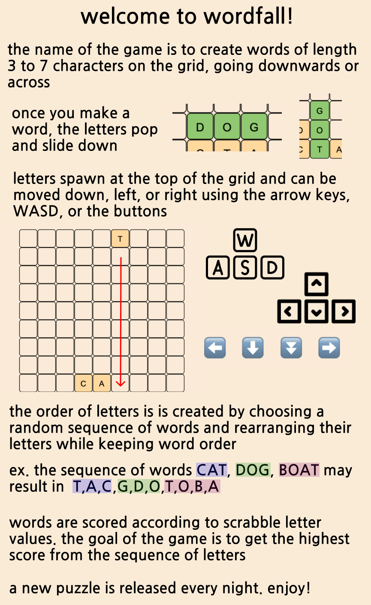

# wordfall.xyz



## Development
Resources:
https://book.leptos.dev/getting_started/index.html
https://github.com/basro/stylance-rs

Run the app
```
# in one terminal
rustup override set nightly
trunk serve --open
```

```
# in another terminal
stylance --watch --output-file ./styles/bundled.scss .
```

```
# use to generate a smaller list of words in case the app is slow
python3 make_words_rs.py
```

Environment
```
rustup 1.27.0 (bbb9276d2 2024-03-08)
info: This is the version for the rustup toolchain manager, not the rustc compiler.
info: The currently active `rustc` version is `rustc 1.79.0-nightly (0ad927c0c 2024-03-21)`
```
